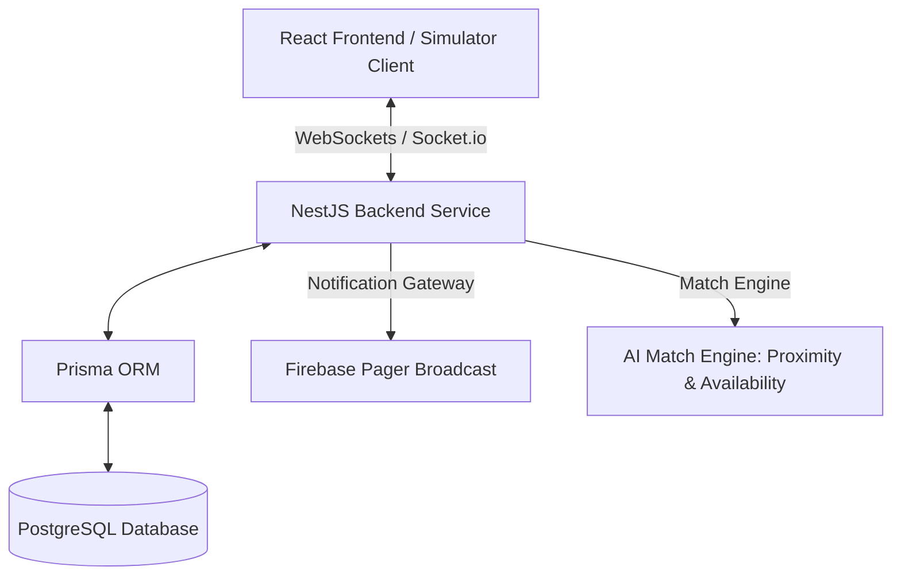

# SETU (सेतु) – Multi-Hospital Specialist Scheduling & Emergency Dispatch Network


> **Theme**: Open Innovation | **Team**: Warriors (AMC Engineering College, Bengaluru)  
> **Hackathon**: DSU DevHack 3.0 Idea Submission

---

## 📌 Problem Statement
Emergency healthcare coordination in India is severely fragmented. When a critical situation arises (e.g., Code Blue), on-call specialist doctors are often split across multiple independent hospitals. This fragmentation leads to:
* **Manual Outreach**: Hospital staff spending 30+ critical minutes calling around to find and verify available specialists.
* **Commute & Schedule Conflicts**: Doctors practicing across multiple nodes without real-time multi-hospital schedule synchronization.
* **Golden Hour Delays**: Emergency response times averaging 30-45+ minutes, which directly impacts patient survival rates.

## 🚀 Our Solution: SETU (सेतु)
**SETU** bridges independent hospitals into a unified, life-saving grid. By automating specialist coordination, SETU aims to reduce critical emergency response times by **88%** (from 45 minutes down to **under 5 minutes**).

### Key Features
1. **Unified Scheduling Grid**: Consolidates clinician availability across all affiliated network nodes, avoiding scheduling overlaps and travel conflicts.
2. **AI-Powered Match Engine**: Instantly ranks and pages specialists based on proximity, real-time availability, past response metrics, and calculated commute ETAs.
3. **Live Commute Tracking**: Visualizes en-route doctors on a live map with auto-updating coordinate-based check-in status sync.
4. **Immutable Trust Ledger**: Cryptographically logs response times and clinician metrics, complying with the DPDP (Digital Personal Data Protection) Act.
5. **Global Patient Handoff Ledger**: Compiles secure clinical notes and broadcasts them instantly to patient records upon doctor arrival.

---

## 🛠️ Technical Approach & Stack

### System Architecture


### Technology Stack
* **Frontend**: React.js, Vite, Tailwind CSS, Vanilla CSS (with Light/Dark Mode)
* **Backend**: NestJS (TypeScript), WebSockets (Socket.io)
* **Database**: PostgreSQL (Prisma ORM)
* **Authentication**: JWT & JWT Refresh tokens
* **Auditing**: Cryptographic Trust Ledger

---

## 💻 Simulators & The Judge Mode Storyboard
SETU includes a custom **Judge Mode Storyboard** console to demonstrate the end-to-end flow of the application during evaluation.

### The Code Blue Simulation Steps:
1. **Phase 1 (Doctor Status)**: Dr. Rajesh Sharma is active on a consultation in Delhi.
2. **Phase 2 (Emergency SOS)**: Code Blue Emergency SOS triggered at Chennai node (e.g., Apollo Chennai). Pagers are activated.
3. **Phase 3 (AI Match Engine)**: AI Match Engine runs to rank matching specialists based on availability, proximity, workload, and response reliability.
4. **Phase 4 (Doctor Dispatch)**: Dr. Rajesh Sharma receives the pager alert and accepts the emergency dispatch from the Delhi node.
5. **Phase 5 (Commute Tracking)**: Live commute tracking on the map interpolates coordinates dynamically.
6. **Phase 6 (Arrival & Resolution)**: Specialist arrives, the emergency is resolved, and an automated **Patient Handoff Note** is generated and cryptographically logged.

---

## 🚀 Running the Project Locally

### Prerequisites
* [Node.js](https://nodejs.org/) (v18+ recommended)
* [NPM](https://www.npmjs.com/)

### Step 1: Clone the Repository
```bash
git clone https://github.com/tanish0320/Setu.git
cd Setu
```

### Step 2: Set Up and Run the Frontend
1. Navigate to the root directory.
2. Install dependencies:
   ```bash
   npm install
   ```
3. Start the Vite development server:
   ```bash
   npm run dev
   ```
4. Access the frontend dashboard at `http://localhost:5173`.

### Step 3: Set Up and Run the Backend API (Optional)
1. Navigate to the `backend` directory:
   ```bash
   cd backend
   ```
2. Install dependencies:
   ```bash
   npm install
   ```
3. Set up your `.env` variables (e.g. database credentials in `DATABASE_URL`).
4. Generate the Prisma client and run migrations:
   ```bash
   npx prisma generate
   npx prisma db push
   ```
5. Start the development server:
   ```bash
   npm run start:dev
   ```
6. The backend API is active at `http://localhost:3000` with Swagger docs at `http://localhost:3000/api/docs`.

---

## 📈 Impact and Feasibility
* **88% Response Delay Reduction**: Shrinks response times from 45 minutes to < 5 minutes.
* **Unified Save-Lives Grid**: Connects multiple independent hospitals to a single, seamless dispatch node.
* **Golden Hour Efficiency**: Maximizes critical care response during the most vital windows of patient emergencies.
